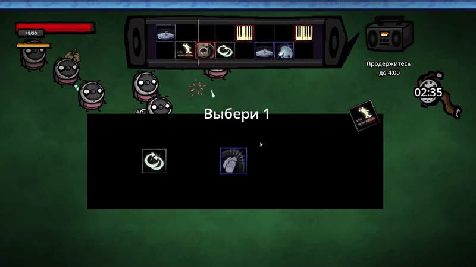

# ThisIsMISIS - Grave Rave
# 🎵 GRAVE RAVE  
Музыкальный vampire-like с уникальной ритм-механикой, в которой каждая нота — это атака, а каждая мелодия — оружие.  
Игра была создана в рамках хакатона **Синеус 2025** по теме **«Ритм и Хаос»**.

---

## 🎮 Как поиграть

### 🔹 Вариант 1 — скачать и запустить .exe  
В корне репозитория лежит файл:  
**`GraveRave.exe`** — просто скачайте и запустите.

### 🔹 Вариант 2 — играть онлайн  
Игра доступна на itch.io:  
👉 https://geskawary234.itch.io/graverave

---

## 🧩 Основной функционал проекта

- Уникальная механика ритма: сетка 2×8 как музыкальный секвенсор.  
- Игра движется по ритму, автоматически проигрывая ноты-атаки.  
- Прогрессия уровней: новые ноты, звуки, модификаторы и типы врагов.  
- Выбор стартовой колоды.  
- Обучение встроено в процесс игры.  
- Начальная заставка и финальная катсцена + полноценная концовка.  
- Возможность рестарта и стабильный игровой цикл.  
- Цельная визуальная, звуковая и атмосферная подача.

---

## 🛠 Технологии и инструменты

**Игровой движок:**  

**Создание катсцен:**  

**Звук и музыка:**  

**Отрисовка персонажей и арт:**  

---

## 👥 Команда проекта

| Участник | Роль | Контакты |
|---------|------|----------|
| **Писков Макар** | Тимлид, ПМ |  |
| **Кеппель Юрий** | Разработчик |  |
| **Драгович Данило** | Разработчик |  |
| **Сафронов Илья** | Звукорежиссёр, монтажёр |  |
| **Федрушкова Юлия** | 2D-художник |  |

---

# 🎞 Демонстрация игры

## 🎼 Основная механика

Основная механика: **сетка 2×8, как музыкальный секвенсор**.  
Игра двигается по ритму — **слева направо, колонка за колонкой**.  
Когда колонка активируется — **все ноты в ней проигрываются и запускают атаки**.

  
*Гифка демонстрации основной механики*

---

## 🧠 Прогрессия и тактика

- С каждым уровнем игрок выбирает **новую ноту**, расширяя возможности.  
- Постепенно открываются **новые звуки** и **новые типы врагов**.  
- Чтобы выжить — нужно **перестраивать ритм под новых противников**, адаптируя стратегию.

  
*Гифка демонстрации прогрессии и тактики*

---

## ✨ Фишки и уникальность

Ниже — ключевые особенности игры.  
Каждый пункт сопровождается отдельной GIF-демонстрацией.  
Блоки отображаются в одной строке благодаря HTML.

  

    <h4>🎯 Уникальная механика атаки</h4>
    
  

  

    <h4>🎬 Начальная заставка и финальная катсцена</h4>
    
  

  

    <h4>👾 Разнообразие атак и врагов</h4>
    
  

 

  

    <h4>🔁 Возможность рестарта</h4>
    
  

  

    <h4>🏁 Есть концовка игры</h4>
    
  

  

    <h4>🧩 Модификаторы атак</h4>
    
  

 

  

    <h4>🎵 Выбор начальной колоды</h4>
    
  

  

    <h4>📚 Обучение по ходу игры</h4>
    
  

  

    <h4>💫 Визуальные приятности</h4>
    
  

---

### Онлайн-демо  
https://geskawary234.itch.io/graverave

---

## ✔ Заключение

**GRAVE RAVE** — это завершённая, атмосферная игра с сильной идеей: игрок сам создаёт ритм, а игра превращает его в оружие. Мы объединили музыку, стратегию и хаос, чтобы создать необычный и запоминающийся игровой опыт.

**Потенциальные улучшения:**
- новые зоны, боссы и типы врагов;  
- расширенные музыкальные комбинации и ритм-паттерны;  
- улучшенные катсцены и визуальные эффекты;  
- большая кампания и мета-прогрессия.

---

